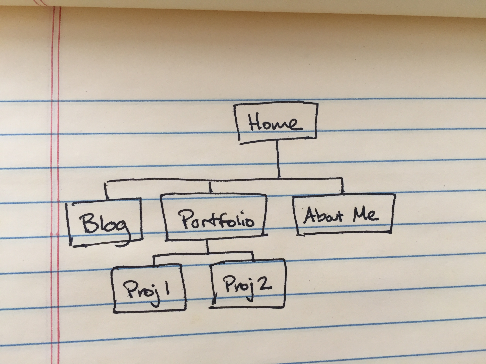

# Site Map

# Reflection Questions

### What are the 6 Phases of Web Design?

1. Information Gathering - identifying the purpose of your website, the intended audience, needed content, etc.
2. Planning - creating the site map, understanding what components need to be included in the website, fitting the different pieces into an intuitive flow
3. Design - creating a visual design/color scheme/fonts/look&feel that is appropriate for your site's purpose and intended audience
4. Development - writing the code to make the site work
5. Testing & Delivery - making sure the site works, is compatible with all browsers/readers, uses up-to-date code, and then delivering to the client either by publishing yourself or delivering files via FTP
6. Maintenance - keeping site up to date with technological improvements, updating content as needed, addressing bug fixes

### What is your site's primary goal or purpose? What kind of content will your site feature?

My site will be my introduction to prospective employers/clients. It will include descriptions of my prior work experience, portfolio page, About Me section and a blog page.

### What is your target audience's interests and how do you see your site addressing them?

My target audience will want to see proof that I will be a capable employee/contractor. My site will present examples of previous good work, and the site itself will represent my capabilities.

### What is the primary "action" the user should take when coming to your site? Do you want them to search for information, contact you, or see your portfolio? It's ok to have several actions at once, or different actions for different kinds of visitors.

Primarily I want visitors to easily view my portfolio and then contact me. The About Me and blog sections will provide greater insight into my person, in case the audience finds them relevant.

### What are the main things someone should know about design and user experience?

User experience is about how people feel when using your site, and can make or break a site, regardless of how many features you have or how cool they are -- if people don't like using your site, they won't come back.  There are no hard and fast rules around this design, as it is very subjective and requires lots of fine tuning to get right.  Lots of design choices won't even be apparent until the user has something to react to, so be ready to make edits on the fly as feedback comes in.

### What is user experience design and why is it valuable?

User experience design is a way of designing a website by making it as pleasant to use as possible.  This is valuable because if people don't like using your site, they won't come back to it.

### Which parts of the challenge did you find tedious?

I'm planning an online portfolio for my site, but I don't have a good grasp on what future employers will want to see. This made the planning stage a little tricky, but I wouldn't call it tedious. Using the markdown language for the reflection document was a little tedious, because the language itself seems redundant with HTML.