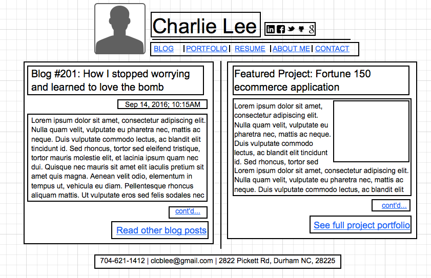
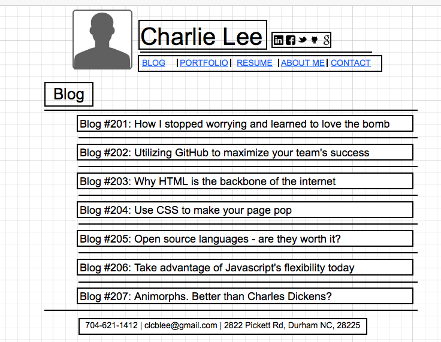

# Index Wireframe

# Blog Wireframe

# Reflection Questions

#### What is a wireframe?

A wirframe is a draft layout of a website. It functions similarly to a building's blueprint.  The elements of the page are displayed using blank-and-white boxes, so that the designer can visualize how the page will dispaly onscreen.

#### What are the benefits of wireframing?

Wireframes let you arrange the page before worrying about more detailed design aspects, such as color schemes or fonts.  It can also be used for early UX feedback and is easily changed.  Once a wireframe has been finalized, it can be sent to other developers to be used as the basis for the actual site.

#### Did you enjoy wireframing your site?

I did enjoy wireframing, although I spent way too much time on it. It was very easy to get sucked into making it perfect, and I kept messing up my Pomodoro timers, so I lots too much time working on it.

#### Did you revise your wireframe or stick with your first idea?

I revised the crap out of it, and still ended up with my original idea.  I sketched it out on paper first, and then used Moqups.com to create the actual wireframe. In the digital version, I kept the same basic layout, but slightly modified almost every element. Then I realized it was too rigid and I didn't quite like the end result, so I reworked it again to make it a little looser with boxes around every element.  The file design is actually much closer to my original sketch than the first onscreen iteration.  I feel the looser version does a better job of capturing the intent and would be easier for another developer to translate onscreen.

#### What questions did you ask during this challenge? What resources did you find to help you answer them?

I had to look up the shortcut for taking a screenshot on my laptop, which I always forget how to do.  I also wasn't sure how to organize my main contact information, so I looked at the personal pages of some of my friends in Silicon Valley for inspiration. My favorite was an incredibly minimal page that had only his name and links to to his social network profiles. I ended up putting more content than that on mine, but thought his was very interesting in terms of the site's function.

#### Which parts of the challenge did you enjoy and which parts did you find tedious?

I really enjoyed getting a chance to start laying some of my own ideas, rather than following step by step instructions, and also looking up other personal pages people have made in the past.  I found the online articles to be a little long, particularly the optional one, but understood the purpose and wasn't bored by them.