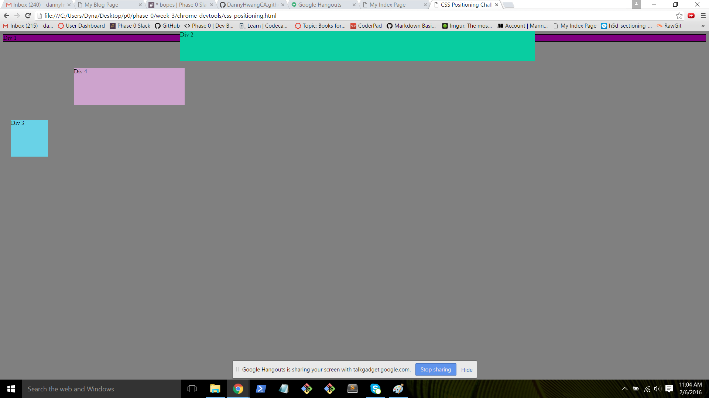

## CSS Positioning Pair Reflection

### Images

### How can you use Chrome's DevTools inspector to help you format or position elements?

Chrome's DevTools inpector lets you edit your CSS code within the browser, so you can quickly see how the page will behave if you alter certain elements.

### How can you resize elements on the DOM using CSS?

In the DOM, you can find an individual element and view its associated CSS. In the CSS, you can either change the existing code determining its size, or you can add the size (height/width) if it's missing.

### What are the differences between absolute, fixed, static, and relative positioning? Which did you find easiest to use? Which was most difficult?

Static is the default, and just lines up the elements according to their order. Relative places the element in the default location and then lets you move it from that location without affecting the location of the other elements. Absolute lets you place the element relative to its original location, but the subsequent elements then fill the space it vacated. Fixed position lets you move the element around like absolute, but the element then stays in that exact locationon the screen, even if you scroll up and down.

### What are the differences between margin, border, and padding?

Padding is the space directly around the element.  The border goes around the padding. The margin goes around the border, and is the distance between the border and any other elements.

### What was your impression of this challenge overall? (love, hate, and why?)

I liked this challenge. It was so simple in intent that it was easy to see what the various effects of each change were. My partner and I were even able to spend a little extra time talking through the differences of the position attributes to make sure we understood them.
