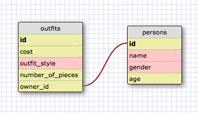

## SQL Queries

##### 1. Select all data for all states.

`SELECT * FROM states;`

##### 2. Select all data for all regions.

`SELECT * FROM regions;`

##### 3. Select the state_name and population for all states.

`SELECT state_name, population`
`FROM states;`

##### 4. Select the state_name and population for all states ordered by population. The state with the highest population should be at the top.

`SELECT state_name, population`
`FROM states`
`ORDER BY population DESC;`

##### 5. Select the state_name for the states in region 7.

`SELECT state_name`
`FROM states`
`WHERE region_id = 7;`

##### 6. Select the state_name and population_density for states with a population density over 50 ordered from least to most dense.

`SELECT state_name, population_density`
`FROM states`
`WHERE population_density > 50`
`ORDER BY population_density ASC;`

##### 7. Select the state_name for states with a population between 1 million and 1.5 million people.

`SELECT state_name`
`FROM states`
`WHERE population BETWEEN 1000000 AND 1500000;`

##### 8. Select the state_name and region_id for states ordered by region in ascending order.

`SELECT state_name, region_id`
`FROM states`
`ORDER BY region_id ASC;`

##### 9. Select the region_name for the regions with "Central" in the name.

`SELECT region_name`
`FROM regions`
`WHERE region_name LIKE '%Central%';`

##### 10. Select the region_name and the state_name for all states and regions in ascending order by region_id. Refer to the region by name. (This will involve joining the tables).

`SELECT regions.region_name, states.state_name`
`FROM regions`
`JOIN states ON regions.id = states.region_id;`

## My Own Schema

## Reflection

##### What are databases for?

Databases store large amounts of data to e quickly accessed by a computer. They allow for multiple sets of data to be stored together, with relational links between the different tables.

##### What is a one-to-many relationship?

A one-to-many relationship is a data relationship where many rows link to another, single row. In this relationship, the shared row is said to be the 'one' and the other rows are the 'many'. This lets multiple records has a shared characteristic.

##### What is a primary key? What is a foreign key? How can you determine which is which?

A primary key is a unique, numeric identifier within a table, stored in its own column. All records within that table will have a unique primary key that referse to their row, and their row alone. A foreign key is a column that contains the primary key for a different table. This establishes a link between the two tables that can be used for joins. A single foreign key can be shared by multiple rows on the same table.

##### How can you select information out of a SQL database? What are some general guidelines for that?

You can select data from a SQL database using SQL queries. Generally, you will use a syntax like `SELECT __ FROM ___"` where the data columns to retrieve are put after SELECT and the table to retrieve them from comes after the FROM. Other qualifiers can be added, such as `ORDER BY __`, `WHERE __`, and `GROUP BY __`. These are used to apply additional logic to the output.