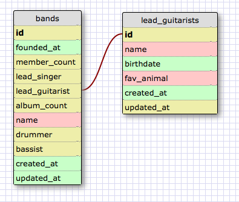
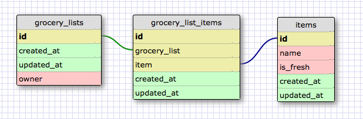

## One-to-One Schema

I used a one-to-one relationship between band and lead guitarist because each guitarist is only part of one band.  Some bands won't have a lead guitarist, like the Temptations, so in those cases the lead_guitarist field will be NULL. Also, there are a lot of data points that are specifically related to the guitarist, so this will keep that data separate from the general band's data.

## Many-to-Many Schema

## Reflection

##### What is a one-to-one database?

A one-to-one database is a database that links two distinct, but related data points together. It allows you to capture information about each one independently, but also allows for a single entity in either table to exist without linking to the other.

##### When would you use a one-to-one database? (Think generally, not in terms of the example you created).

I would use it in a case where I needed to capture information relating to two different objects, but where those objects would be related to each other, or if there were instances where a row didn't need another object to link to.

##### What is a many-to-many database?

A many-to-many database is a database that stores multiple tables independently of each other, but then allows for records in one tables to link to multiple rows in the other. It tracks each possible linking between the two tables independently.

##### When would you use a many-to-many database? (Think generally, not in terms of the example you created).

You would use a many-to-many database in cases where you have multiple records of multiple different entities, and you need to create lists that could include multiple instancs of each.

##### What is confusing about database schemas? What makes sense?

It's sometimes confusing to know when you would create a one-to-one relationship versus having everything on a single table. Additionally, I want to spend some more time and work on a few examples of a many-to-many relationship to establish best practices. I could envision a situation where you stored  multiple items in an array or object, rather than in a join table. So I want to see why the join table is a best practice, generally speaking.